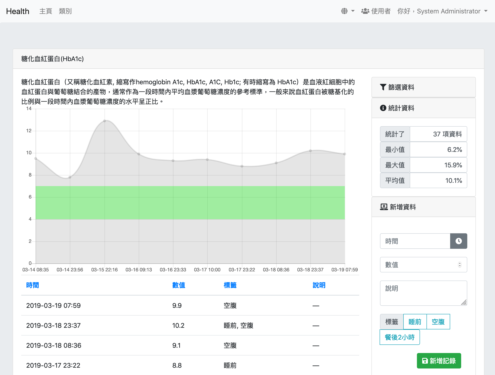
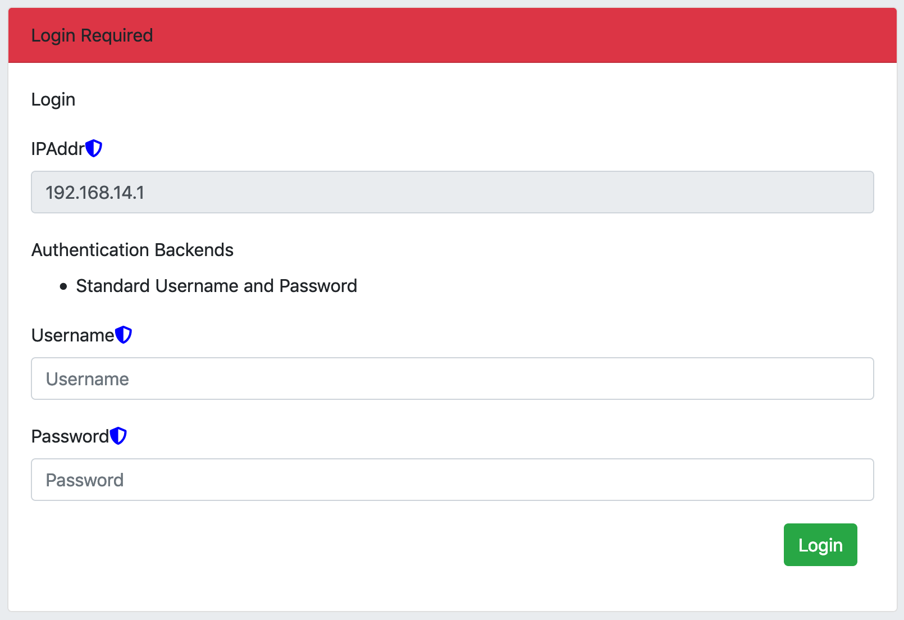
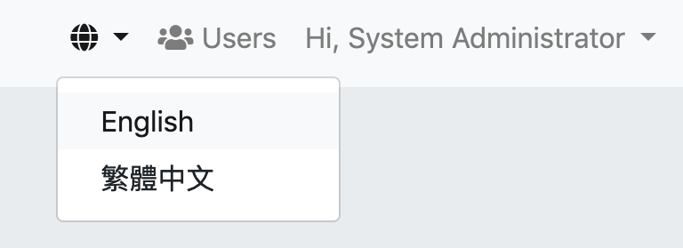
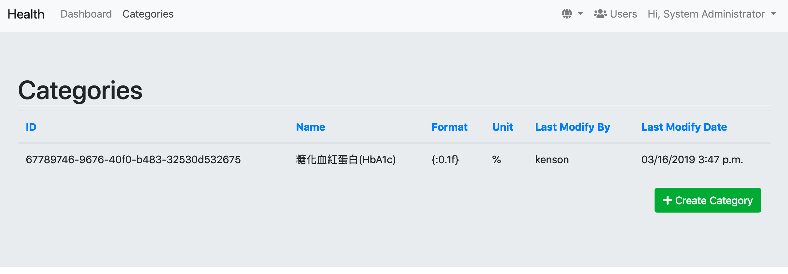

Health
====

Provide the basic features to record the health properties.



Docker
====

The application is developed by [Docker](https://www.docker.com/) technologies.

## Get Started 

1. After checkout the source code, simply switch to the "production" branch:

   ```bash
   git checkout -b production origin/production
   ```

2. (Optional)Configure and alter the source code as you wish.

3. Execute the belows command to build the docker image:

    ```bash
    docker build -t hubs.mansonsolutions.hk/kenson.health:latest .
    ```

4. Execute the application in docker the following command(The environment variables can be found [here](#env)):

   ```bash
   docker run --name health.kenson.idv.hk --rm -p 80:80 -p 443:443 [-e "ENV=value"] hubs.mansonsolutions.hk/kenson.health:latest
   ```

5. Execute the application by vist the [http://localhost/](http://localhost/) or [https://localhost/](https://localhost/). 



6. The application will accept and create the first login provide as the system-administrator. 


7. The language and locale can be selected by Lang menu which located in menu-bar.



8. Create the first Category.



Supported Environment Variables<a name="env"></a>
====

### Database related
- DBMS                  - The database backend. e.g.: "django.db.backends.sqlite3", "django.db.backends.postgresql";
- DBNAME                - The name of the database. If sqlite3, this should be the database file path (e.g. "./sqlite3.db");
- DBHOST                - The host-name of the database;
- DBPORT                - The port-num of the database;
- DBUSER                - The database login name;
- DBPASS                - The database login password;

### Django related
- SECRET_KEY            - The [secret key](https://docs.djangoproject.com/en/2.1/ref/settings/#std:setting-SECRET_KEY) in django;
- SECURE_SSL_REDIRECT   - The boolean value of [secure ssl redirect](https://docs.djangoproject.com/en/2.1/ref/settings/#std:setting-SECURE_SSL_REDIRECT) in django;
- ALLOWED_HOST          - The [host name](https://docs.djangoproject.com/en/2.1/ref/settings/#std:setting-ALLOWED_HOSTS);
- DEBUG                 - The indicator of [debug](https://docs.djangoproject.com/en/2.1/ref/settings/#std:setting-DEBUG) status;
